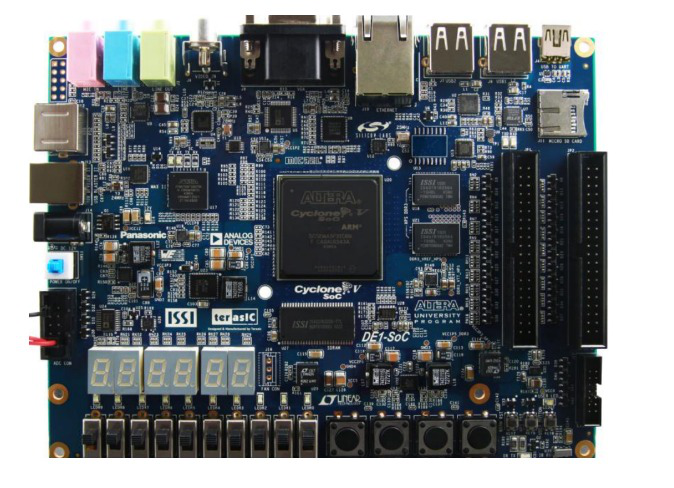
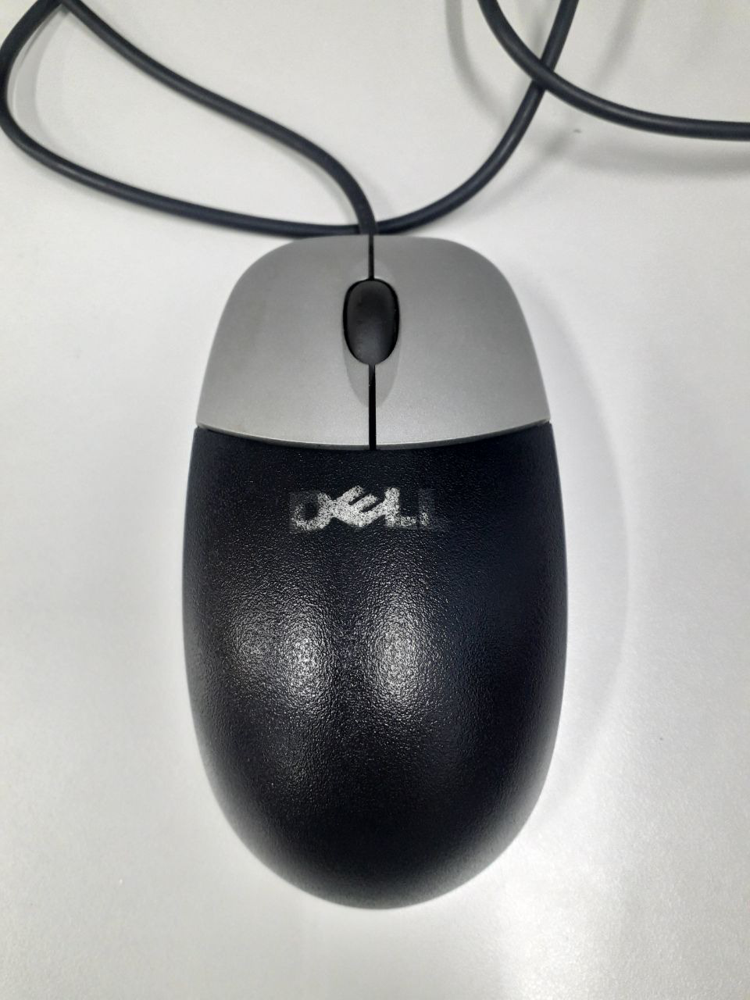
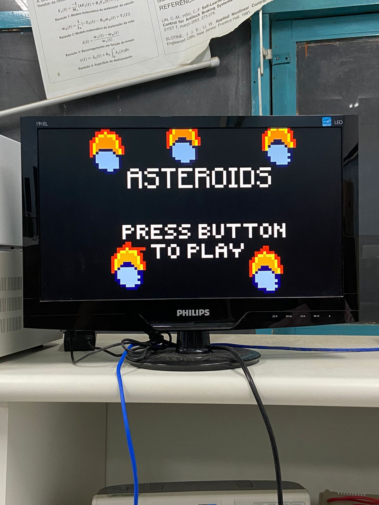
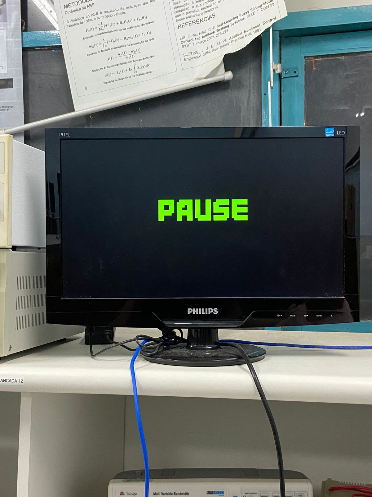
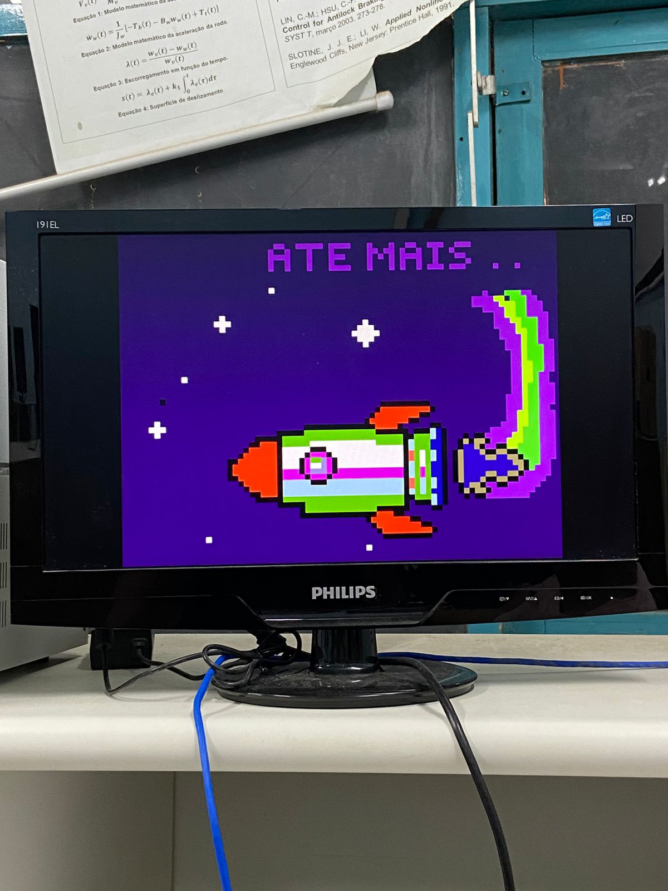
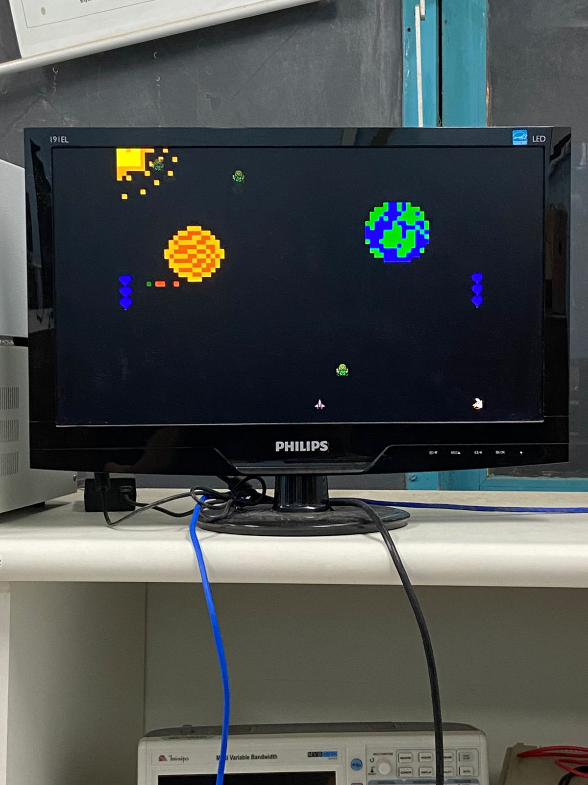

  

# Projeto da disciplina TEC 499 Sistemas Digitais 

**Problema III - TEC499 - MI Sistemas Digitais - 2024.2**

 

[**SOBRE**](#sobre-o-projeto) • [**CARACTERÍSTICAS**](#características-do-projeto) • [**REQUISITOS**](#requisitos) • [**HARDWARE**](#hardware-utilizado) • [**SOFTWARE**](#software-utilizado) • [**DESENVOLVIMENTO**](#desenvolvimento-e-execução-do-projeto) • [**FUNCIONAMENTO**](#funcionamento-do-jogo) • [**SOLUÇÃO**](#solução-do-jogo) • [**BIBLIOTECAS**](#bibliotecas-utilizadas)  • [**CONCLUSÃO**](#conclusão) • [**EXECUÇÃO**](#execução-do-projeto) • [**DESENVOLVEDORES**](#desenvolvedores)

## SOBRE O PROJETO

 

O objetivo geral do projeto é implementar um jogo utilizando a biblioteca em assembly contendo funções gráficas para facilitar a sua implementação, o jogo desenvolvido foi o Asteroids, inspirado na franquia "Space Invaders", desenvolvido em C e exibido em um monitor VGA utilizando a interface de conexão entre HPS e FPGA da DE1-SoC.
## CARACTERÍSTICAS DO PROJETO

- **Linguagem**: C e Assembly 
- **Plataforma**: DE1-SoC (com FPGA Cyclone V)
- **Controle de Jogo**: Acelerômetro ADXL-345 e mouse 
- **Saída de Vídeo**: Conexão VGA

## REQUISITOS

 

1. O código deve ser escrito em linguagem C e a biblioteca do
Processador Gráfico em Assembly;
2. O sistema só poderá utilizar os componentes disponíveis na
placa;
3. Deverá utilizar todas as funções implementadas na biblioteca
do Processador Gráfico e no mínimo um novo sprite deve ser
colocado na memória e utilizado no jogo;
4. Os dois jogadores devem jogar simultaneamente utilizando
obrigatoriamente o acelerômetro, e adicionalmente o mouse;
5. A variação da velocidade no movimento deve ser refletida na
ação do ator do jogo. Por exemplo, no jogo breakout a barra
se move com velocidade maior se o movimento do mouse for
brusco;
6. Informações do jogo (placar, vidas, etc.) devem na tela do
jogo;
7. O jogo deve permitir ações do usuário através dos botões da
DE1-SoC, no mínimo: a pausa, o retorno, o reinício e o
término do jogo.
  * O usuário poderá parar e reiniciar o jogo em
qualquer momento;
  * O usuário poderá sair do jogo em qualquer
momento.
8. Pelo menos dois elementos passivos do jogo deverão se
mover.
9. Os jogos de tabuleiro e/ou turno (xadrez, dama, etc.), tetris e
jogo da forca e da velha estão vetados. Adicionalmente, cada
grupo deverá desenvolver um jogo diferente dos demais.

## HARDWARE UTILIZADO

 

<b>kit de desenvolvimento DE1-SoC</b>

 

  

A placa DE1-SoC é um kit de desenvolvimento que combina um processador ARM Cortex-A9 dual-core com um FPGA Cyclone V da Intel. Sendo ideal para o desenvolvimento de projetos de prototipagem e desenvolvimento de sistemas embarcados. A execução do jogo é acessada por meio de uma conexão SSH (via Ethernet) através do terminal de um computador.

<b>Acelerômetro ADXL345</b>

O ADXL345 é um acelerômetro digital de baixa potência e alta resolução, projetado para medir aceleração em três eixos (X, Y e Z). Ele pode detectar acelerações de até ±16g com uma precisão de 13 bits e é amplamente usado em dispositivos portáteis, sistemas de navegação, sensores de inclinação, e várias aplicações em robótica e sistemas embarcados.

<b>Mouse DELL M-UVDEL1</b>

 

  

O Dell M-UVDEL1 é um mouse óptico com fio. Possui uma função padrão de dois botões, uma roda central clicável e um design de mão ambidestro. Além disso, usa um laser óptico vermelho padrão para rastreamento na parte inferior.

<b>GPU</b>

A GPU desenvolvida por Gabriel Sá Barreto utiliza uma arquitetura personalizada em FPGA (Field-Programmable Gate Array) para facilitar a criação de jogos 2D. A arquitetura é baseada em sprites, que são pequenos blocos gráficos que representam os elementos do jogo, como personagens, obstáculos e outros objetos visuais. Ela é projetada para renderizar imagens em tempo real em um padrão VGA, com resolução de 640x480 pixels e taxa de atualização de 60 quadros por segundo, permitindo gráficos fluídos e responsivos.

Essa GPU é composta por vários componentes integrados que trabalham de forma coordenada para processar gráficos de forma eficiente. O processador principal, Nios II, é um processador softcore da Altera que executa o código do jogo escrito em C. Ele interage com o processador gráfico dedicado, enviando instruções para movimentação e atualização dos sprites na tela. As instruções são armazenadas em FIFOs (First In First Out), que ajudam a sincronizar as operações entre o processador principal e o processador gráfico.

A arquitetura também inclui um controlador VGA, responsável por sincronizar os sinais de vídeo para a renderização na tela. O processador gráfico realiza a renderização dos sprites com base nas instruções recebidas, o que inclui movimentação, alteração de layout e renderização de polígonos básicos, como quadrados e triângulos. Essas operações são feitas em tempo real, e o sistema de memória de sprites permite armazenar até 32 sprites de 20x20 pixels, que são atualizados automaticamente sem intervenção do software, agilizando o processamento gráfico.

Além disso, há um co-processador integrado que usa uma estrutura de pipeline para otimizar a construção de polígonos convexos, como quadrados e triângulos. Ele calcula a posição dos pixels que formam esses polígonos e usa um sistema de prioridade para lidar com sobreposições. Esse co-processador trabalha a uma frequência de 100MHz, processando instruções em paralelo para garantir que cada pixel seja atualizado a tempo para o próximo quadro, permitindo gráficos mais complexos sem comprometer a performance.

A GPU também oferece uma API simplificada para facilitar o desenvolvimento dos jogos, disponibilizando funções para definir e controlar sprites e o background. Essa API permite que desenvolvedores programem movimentações e detectem colisões entre sprites, facilitando a criação de jogos bidimensionais. Essa estrutura foi validada com a criação de jogos clássicos como *Asteroids* e *Space Invaders*, o que demonstrou a capacidade da arquitetura em suportar jogos 2D interativos com elementos móveis e gráficos em tempo real.

## SOFTWARE UTILIZADO

 

<b>Linguagem C</b>

A linguagem C foi escolhida por sua eficiência, portabilidade e grande popularidade em sistemas embarcados. Sua sintaxe clara oferece controle direto sobre o hardware, ao mesmo tempo em que suas bibliotecas padrão e ferramentas possibilitam o desenvolvimento de código compacto e otimizado para dispositivos com restrições de recursos.

<b>Linguagem Assembly</b>

Assembly é a linguagem de programação de mais baixo nível,  que fornece um mapeamento direto das instruções. No problema foi utilizado o assembly desenvolvido para a arquitetura ARMv7.

<b>Compilador GNU</b>

O Compilador GNU (GCC - GNU Compiler Collection) é uma coleção de compiladores de código aberto que faz parte do projeto GNU, sendo amplamente utilizado para compilar programas em várias linguagens de programação, como C, C++, Fortran, Ada e outras. Ele é um dos compiladores mais populares e é essencial no desenvolvimento de software livre e projetos baseados em Linux.

<b>VS CODE</b>

O Visual Studio Code (VSCode) é um editor de código-fonte leve, desenvolvido pela Microsoft, que oferece uma ampla gama de funcionalidades para programadores. Ele é gratuito, de código aberto e disponível para várias plataformas, incluindo Windows, macOS e Linux.

## DESENVOLVIMENTO E EXECUÇÃO DO PROJETO

 

<b>Acelerômetro, Mapeamento de Memória e I2C</b>

O acelerômetro utilizado no jogo é um dispositivo ADXL345, que se comunica via o barramento I2C (Inter-Integrated Circuit). Para acessá-lo, o código implementa o mapeamento de memória e manipulação direta de registradores. Mapeamento de Memória: O sistema Linux oferece um dispositivo especial chamado /dev/mem, que permite que processos de usuário acessem endereços físicos de hardware. O código usa o mapeamento de memória através da função mmap(), transformando os registradores do controlador I2C em ponteiros acessíveis pelo programa. Isso permite a leitura e escrita direta nos registradores de controle do barramento I2C. Comunicação I2C: Após o mapeamento, as funções implementadas permitem a leitura e escrita nos registradores do acelerômetro. Para isso, a inicialização do controlador I2C é feita com a função I2C0_Init(), que configura o dispositivo para o modo mestre e define o endereço do acelerômetro. Funções como accelerometer_x_read() são usadas para capturar os valores do eixo X do acelerômetro, enquanto accelerometer_isDataReady() verifica se os dados estão prontos para leitura. Função no Jogo: O acelerômetro detecta a inclinação do dispositivo, e com base nesses valores, o jogo move as peças para a esquerda ou direita no tabuleiro, conforme os movimentos do jogador. Isso adiciona uma camada de interatividade física ao jogo.

<b>Threads</b>

O jogo faz uso de threads para permitir a execução de tarefas concorrentes. Duas threads são criadas para gerenciar a leitura contínua do acelerômetro e o monitoramento dos botões do dispositivo. Thread do Acelerômetro: A função accel_working() é executada em uma thread separada. Essa thread continuamente verifica se há novos dados no acelerômetro e, se houver, lê os valores do eixo X para determinar se a peça deve se mover para a esquerda ou direita no tabuleiro. O uso de usleep() controla a frequência de leitura para evitar sobrecarga de processamento. Thread dos Botões: A função button_threads() também é executada em uma thread separada, que monitora o estado dos botões do hardware. Os botões têm diferentes funcionalidades: um deles pausa e retoma o jogo, e outro termina o jogo. Isso é feito através de uma leitura contínua dos botões usando a biblioteca KEY_read(), onde os eventos de pressionamento dos botões disparam as ações correspondentes no jogo. Sincronização com o Jogo: As threads permitem que o jogo continue a rodar independentemente, enquanto as entradas de controle (acelerômetro e botões) são monitoradas em segundo plano. Isso garante que a interação seja fluida e sem interrupções na lógica principal do jogo.

<b>Mutex</b>

Mutex, é um mecanismo utilizado em programação concorrente para controlar o acesso de múltiplas threads a um recurso compartilhado, garantindo que apenas uma thread possa utilizá-lo por vez. O objetivo principal é evitar problemas como condições de corrida, que ocorrem quando várias threads tentam acessar e modificar um recurso simultaneamente, resultando em resultados imprevisíveis ou inconsistentes. Como na produção do jogo tivemos que utilizar mais de uma threads e que acessavam a matriz do jogo ao mesmo tempo, foi-se necessário a utilização, para garantir que os acesso.

Quando uma thread precisa acessar um recurso protegido por um mutex, ela o "trava". Isso garante que nenhuma outra thread consiga utilizar o mesmo recurso até que a thread original termine o que precisa e "destrave" o mutex. Durante esse período, as outras threads ficam bloqueadas, aguardando sua vez de acessar o recurso.

Essa abordagem garante a integridade dos dados, mas exige cuidado. Se uma thread esquecer de destravar o mutex, outras threads poderão ficar bloqueadas indefinidamente, levando a um problema chamado deadlock. Além disso, o uso excessivo de mutexes pode impactar o desempenho, já que as threads precisam esperar sua vez para acessar os recursos.

<b>Biblioteca de vídeo</b>

A biblioteca de vídeo desenvolvida em assembly para ARM Cortex-A9 utiliza conceitos de baixo nível para maximizar o desempenho gráfico em dispositivos que operam com recursos limitados. A arquitetura de GPU de Gabriel Sá Barreto oferece uma infraestrutura de suporte à manipulação eficiente de gráficos, complementada por uma API simplificada que facilita a criação e atualização de sprites e o controle de background. Cada função da biblioteca é projetada para interagir diretamente com o hardware, otimizando a velocidade de execução e reduzindo a latência na atualização dos frames.

mem:

Função de manipulação de memória que gerencia a alocação e controle de dados gráficos, como cores de pixels e dados de sprites. Essa função é responsável por armazenar e recuperar informações diretamente da memória, onde os gráficos são processados. Ao lidar com registradores e endereços de memória, a função mem permite acesso direto ao armazenamento dos dados que compõem o display, o que é crucial para otimizar a renderização gráfica.

set_sprite:

Configura a posição de um sprite na tela, definindo suas coordenadas X e Y, seu offset de memória (para identificar o sprite na memória gráfica) e o bit de ativação. A set_sprite utiliza registradores para aplicar rapidamente essas informações, o que possibilita a movimentação dos sprites em tempo real sem impactar o desempenho. Essa função é essencial para controlar personagens e objetos móveis dentro do jogo.
set_dp:

A função set_dp configura o ponto de referência de um polígono, definindo sua posição na tela e outras propriedades, como cor e forma (triângulo ou quadrado). Utilizando o co-processador da GPU, essa função otimiza o processamento de polígonos para que cada elemento gráfico tenha uma orientação e posição específicas, gerando gráficos nítidos e atualizados a cada quadro.

set_background_block:

Define a cor de blocos específicos do background (fundo), segmentados em uma grade de 8x8 pixels, preenchendo cada bloco com valores RGB. Esse método permite personalizar o cenário de forma modular, alterando apenas seções específicas do fundo, o que facilita a criação de cenários complexos sem a necessidade de redesenhar toda a tela.

display_7seg:

A função display_7seg gerencia a exibição de valores numéricos em um display de 7 segmentos, comumente usado para mostrar pontuações, vidas restantes ou temporizadores. A função converte os valores em números visíveis no display, que é sincronizado com o estado atual do jogo. A interação direta com o hardware permite uma atualização rápida e precisa, melhorando a interatividade visual.

push_button:

Gerencia as entradas de botões físicos, capturando os sinais de pressão e associando-os a ações específicas no jogo, como saltar, atirar ou mover. Essa função lê o estado de cada botão e, ao ser acionado, dispara as operações correspondentes, permitindo que os jogadores controlem diretamente os elementos da interface de maneira precisa e com baixa latência.

Save_sprite:

A função Save_sprite funciona como um looping que chama a função wsm para pintar na cor de cada pixel do sprite que lhe foi passado. No nosso jogo foi utilizada na criação dos sprites novos para serem utilizados.

wrregfull:

A função wrregfull verifica se as FIFOs (First In, First Out) usadas para armazenar instruções estão cheias, evitando sobrecargas e erros de dados. Ela garante que as instruções sejam processadas na ordem correta e sem perda, essencial para a renderização contínua e estável dos gráficos. Esse controle de fluxo é fundamental para manter o desempenho do sistema gráfico e garantir a integridade dos dados visuais.
Essas funções, projetadas para o ARMv7 Cortex-A9, atuam em conjunto com o co-processador gráfico, aproveitando pipelines e manipulação direta de registradores. Essa abordagem assegura um processamento gráfico eficiente, adequado para aplicações de jogos que demandam renderização rápida e responsiva.

<b>Mapa, naves e asteroides no VGA</b>

O jogo exibe um mapa e as entidades na tela utilizando um controlador VGA (Video Graphics Array).

Mapa:
O mapa do jogo é representado por uma matriz bidimensional (int board[ROWS][COLS]) que modela o espaço onde as naves, asteroides e projéteis estão localizados. A função initMap() inicializa essa matriz, onde cada célula pode estar vazia, conter uma nave, um asteroide ou um projétil. O mapa é renderizado na tela a cada iteração do loop principal do jogo, sendo atualizado conforme as naves se movem, os asteroides mudam de posição ou os projéteis são disparados.

Naves e Asteroides:
As naves do jogo, controladas pelos jogadores, e os asteroides, gerados aleatoriamente, são representados por structs que contêm suas posições e características específicas. A função UpdateAsteroids() é responsável por criar novos asteroides em posições aleatórias. Os projéteis disparados pelas naves, gerados pela função shootProjectile(), podem destruir asteroides.

Exibição VGA:
A comunicação com a tela VGA é realizada através de um processador gráfico desenvolvido pelo estudante Gabriel Sá Barreto. As funções set_sprite, set_background_block gerenciam a exibição gráfica. A tela é constantemente limpa e redesenhada a cada ciclo do jogo para refletir o estado atual do mapa, incluindo a posição das naves, dos asteroides e dos projéteis, bem como a pontuação de cada jogador. O trabalho de conclusão de curso de Gabriel Sá por ser acessado em:
https://drive.google.com/file/d/1MlIlpB9TSnoPGEMkocr36EH9-CFz8psO/view

## FUNCIONAMENTO DO JOGO

 

O jogo Asteroids Multiplayer é baseado no controle de naves, asteroides e projéteis. As mecânicas foram adaptadas para permitir uma experiência interativa e dinâmica, aproveitando sensores como o acelerômetro e mouse para controle das naves.

**Início:**

O jogo começa em um espaço aberto representado por uma matriz retangular (10 colunas x 20 linhas), que serve como o campo de batalha. Duas naves controladas pelos jogadores aparecem em posições iniciais distintas, enquanto asteroides começam a surgir de forma aleatória no mapa.

**Mecânica de Jogo:**

Os jogadores controlam suas naves utilizando o acelerômetro e mouse para movimentos laterais. Inclinar a placa para a direita move a nave para a direita no mapa, enquanto inclinações para a esquerda deslocam a nave para a esquerda. Os jogadores podem disparar projéteis para destruir asteroides.

Os asteroides se movem automaticamente em direção ao fundo do mapa, representando um perigo constante para os jogadores. Se um asteroide atingir uma nave, o jogador perde uma vida. Projéteis disparados pelas naves também podem destruir asteroides.

**Objetivo:**

O jogo tem como objetivo sobreviver o maior tempo possível.

**Pausa e retomada**

Botão de Pausa: Quando o jogador pressiona o botão correspondente, o jogo é pausado. Durante a pausa, o jogador não pode se mover, e uma mensagem indicando o estado de pausa aparece na tela. Pressionar o botão novamente retoma o jogo. 

Botão de Retomar: Esse botão é usado para retornar ao jogo após ele ter sido pausado. Ele faz com que o jogo volte à sua dinâmica normal, permitindo o controle das naves e a continuidade da partida. 

Botão de Encerramento: Pressionar este botão encerra o jogo imediatamente, interrompendo qualquer ação em andamento e levando ao fim da partida.

**Botões**

Os botões funcionam em dois estados. 

Estado 1

* Ao pressionar o botão 1 (esquerda para direita), inicia-se uma partida e passa o estado do jogo para o 2
* Ao pressionar o botão 3 (esquerda para direita), encerra o programa

Estado 2

* Ao pressionar o botão 1 (esquerda para direita), o player 1 atira contra os asteroides
* Ao pressionar o botão 2 (esquerda para direita), o partida é pausada
* Ao pressionar o botão 3 (esqueda para direita), o programa é encerrado
* Ao pressionar o botão 4 (esquerda para direita), o jogo é reiniciado

## Solução

<b>Detalhes</b>

 

A implementação apresentada demonstra a capacidade de atender integralmente aos requisitos propostos. Preliminarmente ao laço principal de execução, é realizada uma verificação para confirmar o desejo do usuário em iniciar o jogo. Em seguida, são inicializados os periféricos necessários para o funcionamento do sistema, a saber: interface gráfica (VGA), acelerômetro e botões de controle. Na sequência, são instanciados os elementos essenciais para o jogo, o mecanismo de geração aleatória de peças e as threads responsáveis pela execução concorrente das diferentes funcionalidades do sistema. Dentro do laço principal, o sistema realiza a leitura contínua dos dados provenientes do acelerômetro e verifica a ocorrência de eventos de clique nos botões. Na ausência de eventos de clique, a execução do jogo prossegue normalmente. Os dados obtidos do acelerômetro são utilizados para determinar a movimentação da peça em jogo, que é atualizada de acordo com os valores capturados. Após a atualização da posição da peça, é verificada a ocorrência de colisões com outras peças ou com as bordas do tabuleiro. Caso ocorra uma colisão, a peça é fixada na posição atual, sendo incorporada à matriz principal. Em seguida, é realizada uma verificação para determinar se o jogo chegou ao fim, condição que ocorre quando a pilha de peças atinge o topo do tabuleiro. Caso o jogo não tenha terminado, é verificada a ocorrência de eventos de clique nos botões, sendo executada a ação correspondente a cada botão pressionado. Ao final do jogo, é exibida a mensagem "GAME OVER!" na tela.

## BIBLIOTECAS UTILIZADAS

 

Nesta seção, serão abordadas as principais bibliotecas essenciais para o funcionamento completo do Tetris.

<b>sys/mman</b>
 

O uso de mmap é fundamental para acessar o acelerômetro na DE1-SoC, pois permite mapear o endereço físico do hardware (como o controlador I2C do acelerômetro) diretamente no espaço de memória do processo. Isso facilita a leitura e escrita de registradores do acelerômetro sem a necessidade de chamadas de sistema frequentes, reduzindo a latência e permitindo acesso direto e eficiente ao dispositivo.

<b>pthread</b>
 

A biblioteca pthread é crucial para integrar a leitura dos dados do acelerômetro ao loop principal do tetris, permitindo que ambos funcionem de maneira paralela. Ao criar duas threads principais — uma para a leitura contínua dos dados do acelerômetro e outra para o loop principal do jogo — é possível evitar que a leitura dos sensores bloqueie ou atrase a execução do jogo. A thread dedicada ao acelerômetro interpreta os valores de inclinação para mover as peças do Tetris (esquerda, direita) sem interferir na renderização ou na lógica do jogo. Simultaneamente, a thread do loop principal mantém o fluxo do jogo, verificando colisões, atualizando o estado da tela VGA e respondendo rapidamente às ações do jogador. A sincronização entre as threads, usando mutexes ou variáveis de condição, garante que a comunicação seja correta e sem inconsistências.

<b>Biblioteca desenvolvida pela equipe em assembly</b>

A biblioteca desenvolvida é cruicial para exibir no monitor o jogo. Contém diversas funções responsáveis por realizar o mapeamento da memória, a exibição de blocos no background, a troca de cor do background, além da exibição de sprites.

## RESULTADOS

**Tela inicial**

 

  

**Tela de pausa**

 

  

**Tela de Game over**

 

  

**Tela de Jogo**

 

  

  

    <em><a href="https://youtube.com/shorts/NYChl0sube8?feature=share">Assista ao vídeo de demonstração</a></em>
  

## CONCLUSÃO

A presente implementação do clássico jogo Asteroids, desenvolvida em linguagem C para a plataforma DE1-SoC, demonstra a viabilidade e eficácia da utilização de sistemas embarcados em aplicações de entretenimento. A arquitetura da placa DE1-SoC, aliada a drivers disponíveis e ao processador gráfico desenvolvido pelo estudante Gabriel Sá Barreto , proporcionou o ambiente ideal para o desenvolvimento e execução do jogo, atendendo integralmente aos requisitos propostos. A integração entre o software e o hardware da plataforma permitiu a utilização coordenada de diversos periféricos, como a interface VGA para a renderização gráfica, o acelerômetro para a interação por movimento e os botões para o controle tradicional do jogo. Os testes realizados demonstraram a estabilidade e o desempenho satisfatório do sistema, garantindo a execução confiável do jogo em diferentes cenários. A arquitetura ARMv7 da plataforma DE1-SoC, em conjunto com a linguagem C, proporcionou um ambiente de desenvolvimento eficiente, permitindo a implementação de algoritmos para a execução. Além de cumprir os objetivos específicos do projeto, a implementação do Asteroids em plataforma DE1-SoC contribuiu significativamente para o desenvolvimento das competências dos envolvidos, aprofundando os conhecimentos em sistemas embarcados, arquitetura ARMv7 e programação em linguagem C. A experiência adquirida neste projeto abre novas perspectivas para o desenvolvimento de sistemas digitais mais complexos e a criação de soluções inovadoras em diversos setores.

## EXECUÇÃO DO PROJETO

 

Siga os passos abaixo para baixar, compilar e executar o código do projeto em um dispositivo FPGA DE1-SoC.

<b>Execução</b>

**Passo 1: Clonar o Repositório Abra o terminal e execute o comando a seguir para clonar o repositório com o código-fonte:**

    git clone https://github.com/GHenryssg/Asteroids-Game.git

**Passo 2: Navegar até o Diretório e Compilar**
Após clonar o repositório, entre no diretório do projeto com o comando

    cd Asteroids-Game

**Passo 3: Em seguida, compile e execute o código utilizando o comando:**

    make

## DESENVOLVEDORES

  

<table>
  <tr>
    <td align="center"> <b> Gabriel Henry </b></a> 👨‍💻</a></td>
    <td align="center"> <b> Ilson Neto </b></a> 👨‍💻</a></td>
    <td align="center"> <b> Carlos Arthur </b></a> 👨‍💻</a></td>
    <td align="center"> <b> Luis Guilherme </b></a> 👨‍💻</a></td>
  </tr>
</table>

#### [Voltar ao topo](#projeto-da-disciplina-tec499-sistemas-digitais)

  
